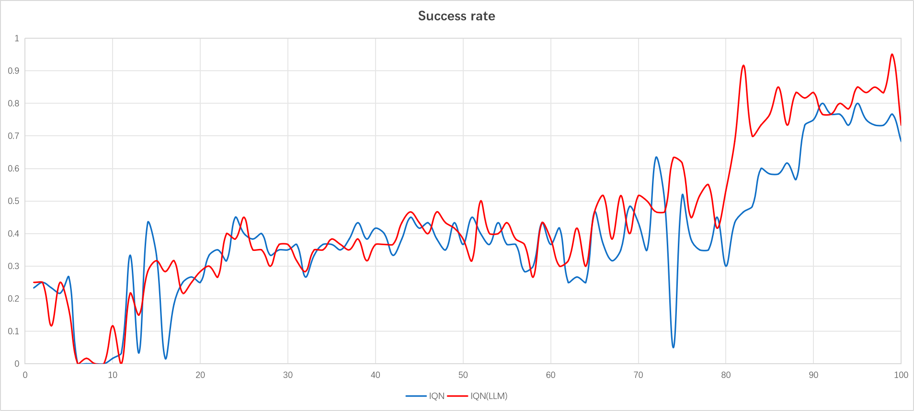
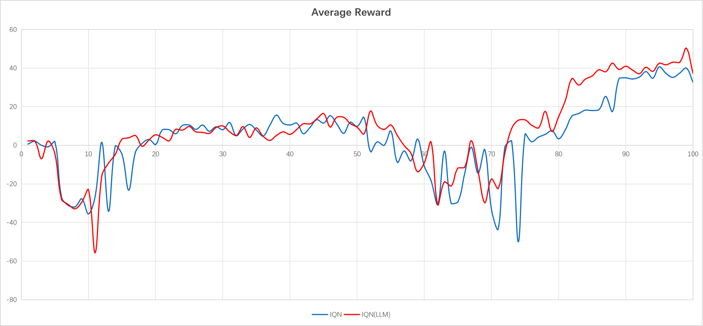
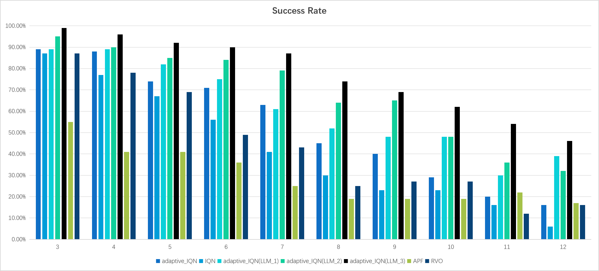
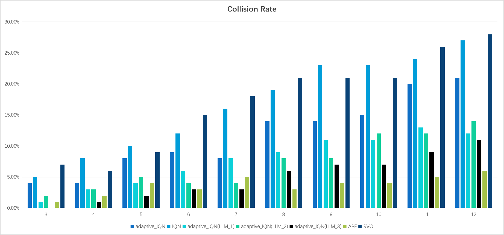

# Enhancing Deep Reinforcement Learning via Large Language Model for Multi-Robot Navigation 

This repository heavily relies on [Xi Lin's work](https://github.com/RobustFieldAutonomyLab/Multi_Robot_Distributional_RL_Navigation). We use the Adaptive_IQN algorithm proposed in [Xi Lin's paper](https://arxiv.org/abs/2402.11799) as the benchmark algorithm. Currently, we are attempting to use large language models (LLM) to guide agents during the training process.

Based on the original code repository, we made modifications to the trainer.py file by loading the pre-trained LLM and providing guidance at critical moments. The guidance from the LLM was given in textual form and mapped to the action space’s probability distribution in a simple manner. Then, in the agents.py file, we weighted the LLM's guidance at the value function level using the IQN algorithm. Additionally, we have made ablation experiments, including:

(1) Designing separate experience replay buffers specifically for the LLM guidance.

(2) Introducing reward plasticity, along with additional punishment when the TTC = 0.25s triggers LLM guidance.

(3) During sampling, incorporating extra JS loss terms based on the experience guided by the LLM, with weight coefficients that decay over time.

In order to debug the guidance method of LLM, we first simplified the environment of the benchmark algorithm and removed the influence of vortices and water flow in the scene. To ensure fairness in the comparison, all other settings of the algorithm remain unchanged. The current experimental results are saved in the training.py file, and the evaluation visualization results during the training process are as follows:

In the above figures, LLM_1 represents the use of LLM guidance and additional experience replay, LLM_2 represents LLM guidance, and LLM_3 represents LLM guidance and additional TTC penalty. The weight files and training logs of the model can be obtained from Baidu Netdisk: https://pan.baidu.com/s/1BZTsWlViOZVN2Yf3oHbs_Q?pwd=1234. According to the chronological order, they are IQN LLM_1、LLM_2、LLM_3.

However, we found that using the random seed setting in the benchmark algorithm code library, the training of the model (i.e. the training curve in the figure above) cannot be reproduced. Therefore, we changed the setting of the random seed in the IQN_model.py and trainer.py files to:

def set_seed(self, seed):
    """
    Set random seeds for reproducibility.
    """
    random.seed(seed)
    np.random.seed(seed)
    torch.manual_seed(seed)
    if torch.cuda.is_available():
        torch.cuda.manual_seed(seed)
        torch.cuda.manual_seed_all(seed)
        torch.backends.cudnn.deterministic = True
        torch.backends.cudnn.benchmark = False
